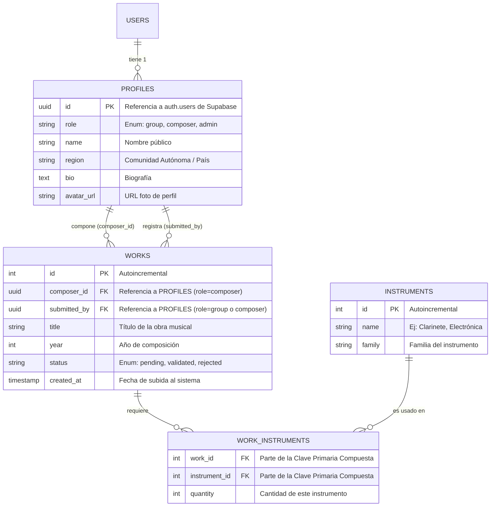

# MÓDULO: Base de Datos
**TAREA:** Diseño inicial del diagrama Entidad-Relación incluyendo la arquitectura de Roles (RBAC)
**ALUMNO:** Manuel Solís
**PROYECTO:** Contemporánica
---

## 1. Arquitectura de Roles (RBAC - Role-Based Access Control)

Para garantizar la seguridad y organizar el acceso a la plataforma Contemporánica, se definen los siguientes roles que se asociarán a la identidad de cada usuario en Supabase:

*   **visitor (Visitante):** Usuario no registrado. Solo tiene permisos de lectura sobre la tabla de obras que tengan el estado 'validado'. No puede interactuar con el sistema de validación ni editar perfiles.
*   **group (Grupo de Música):** Usuario registrado. Tiene permisos de escritura en la tabla `WORKS` para subir nuevas interpretaciones. Puede editar su propio registro en `PROFILES`. No puede validar obras.
*   **composer (Compositor):** Usuario registrado creador de música. Tiene permiso para actualizar el estado (`status`) de una obra en la tabla `WORKS` a 'validado' o 'rechazado', siempre y cuando sea el compositor asignado a dicha obra (`composer_id`). También puede subir obras directamente (que nacen validadas) y editar su perfil.
*   **admin (Administrador):** Equipo de Esemble Sonoro. Tiene control total (Superusuario). Puede realizar un CRUD completo sobre la tabla `INSTRUMENTS`, banear o cambiar el rol de los usuarios en `PROFILES`, y forzar el cambio de estado de cualquier obra.

---

## 2. Diagrama Entidad-Relación (E-R)

El siguiente diagrama representa la estructura inicial de las tablas en Supabase y sus relaciones.

## 3. Diccionario de Datos (Tablas Principales)

*   **PROFILES:** Extiende la tabla interna de autenticación de Supabase (`auth.users`). Guarda la información pública y, lo más importante, el `role` que determina los permisos del usuario en la plataforma.
*   **WORKS:** Es la tabla central del sistema. Registra las obras interpretadas. Contiene dos relaciones fundamentales con los perfiles: quién es el autor (`composer_id`) y quién subió el registro (`submitted_by`). El campo `status` gestiona el ciclo de vida de la obra.
*   **INSTRUMENTS:** Tabla maestra gestionada por los administradores para alimentar los selectores del frontend de forma limpia y evitar errores tipográficos al registrar obras.
*   **WORK_INSTRUMENTS:** Tabla intermedia (N:M). Resuelve el hecho de que una obra requiere múltiples instrumentos, y un instrumento pertenece a múltiples obras. Incluye el campo `quantity` para casos como "2 Violines".
