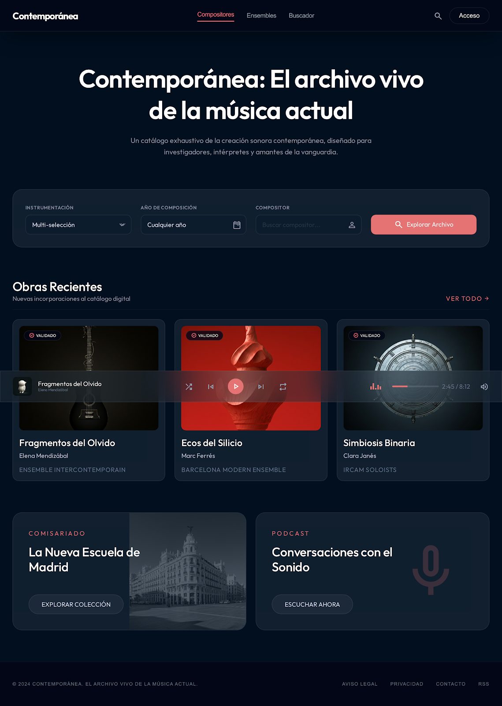
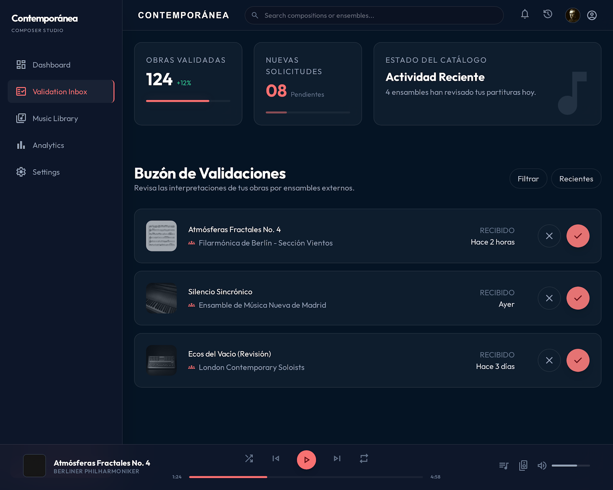

# Informe de Diseño UI/UX - Contemporánica
**Fecha:** 28 de abril de 2026
**Alumno:** Manuel Solís
**Herramienta:** Google Stitch

## 1. Concepto Visual
Para el proyecto **Contemporánica**, se ha definido una línea visual denominada "Modernidad Clásica". El objetivo es transmitir la sobriedad de la música académica contemporánea combinada con la innovación tecnológica de la plataforma.

*   **Modo:** Dark Mode (Fondo `#0F172A`).
*   **Acento:** Salmón/Coral (`#E57373`), derivado del logo corporativo (clave de fa).
*   **Estilo:** Glassmorphism en paneles y tarjetas para generar profundidad.
*   **Tipografía:** Inter / Outfit (Sans-serif de alta legibilidad).

## 2. Pantalla de Inicio (Zona Pública)
La landing page se centra en la facilidad de descubrimiento. 
*   **Buscador Avanzado:** Permite filtrado cruzado por instrumentación, año y compositor.
*   **Secciones:** Feed de obras recientes validadas, secciones de comisariado y acceso a podcasts.

## 3. Dashboard de Gestión (Zona Privada)
El dashboard se adapta según el rol del usuario para garantizar un flujo de trabajo eficiente.

### 3.1. Rol: Compositor (Validador)
*   **Buzón de Validaciones:** El núcleo del sistema. Permite al compositor aprobar o rechazar obras subidas por terceros.
*   **Estadísticas:** Control de obras totales y solicitudes pendientes.

### 3.2. Rol: Grupo/Ensemble (Intérprete)
*   **Registro de Obra:** Proceso simplificado para subir nuevas interpretaciones.
*   **Seguimiento:** Tabla de estados (Pendiente, Validado, Rechazado) para conocer el progreso de sus envíos.

---
*Nota: Las capturas de pantalla de los prototipos se encuentran en la carpeta `/diseno` de este repositorio.*
